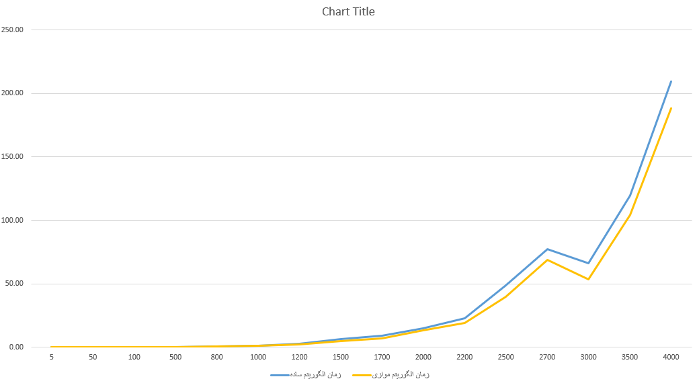
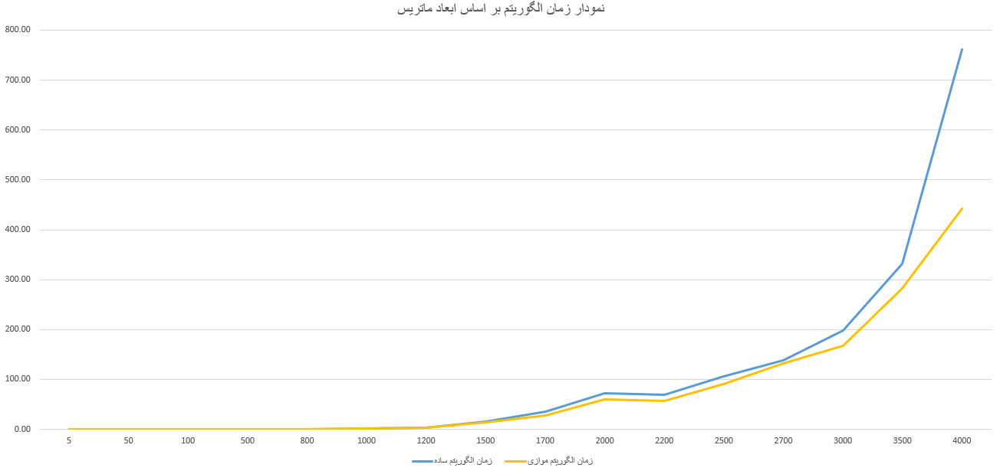

# QR Factorization Project

## Overview
This project implements both parallel and serial versions of QR factorization using the Householder and Gram-Schmidt algorithms. Parallel implementations utilize MPI and OpenMP, while serial versions and Eigen library-based implementations are also provided. Performance metrics are gathered for matrices of various dimensions, and comparisons between the parallel and serial methods are visualized in charts.

## Project Structure
The project directory is structured as follows:

```
.
├── Gram-Schmidt
│   ├── normal
│   │   ├── CMakeLists.txt
│   │   └── GramSchmidtSerial.cpp
│   └── parallel
│       ├── CMakeLists.txt
│       └── GramSchmidtParallel.cpp
├── Householder
│   ├── eigen
│   │   ├── CMakeLists.txt
│   │   └── src
│   │       ├── generate_matrix.cpp
│   │       ├── normal_householder.cpp
│   │       └── parallel_householder.cpp
│   ├── normal
│   │   ├── CMakeLists.txt
│   │   └── HouseholderSerial.cpp
│   └── parallel
│       ├── CMakeLists.txt
│       └── HouseholderParallel.cpp
└── result
    ├── .gitignore
    ├── gram-schmidt-chart.png
    ├── house-holder-chart.png
    ├── results.xlsx
    ├── GeneratedMetrices
    │   ├── generate_matrix.exe
    │   └── {dimension}dim
    │       └── GeneratedMatrix.txt
    ├── GramSchmidtParallel
    │   ├── GramSchmidtParallel.exe
    │   └── {dimension}dim
    │       ├── GeneratedMatrix.txt
    │       ├── outputQ.txt
    │       ├── outputR.txt
    │       └── report.txt
    ├── GramSchmidtSerial
    │   ├── GramSchmidtSerial.exe
    │   └── {dimension}dim
    │       ├── GeneratedMatrix.txt
    │       ├── outputQ.txt
    │       ├── outputR.txt
    │       └── report.txt
    └── HouseHolderSerial
        ├── HouseholderSerial.exe
        └── {dimension}dim
            ├── GeneratedMatrix.txt
            ├── outputQ.txt
            ├── outputR.txt
            └── report.txt
```

### Gram-Schmidt Directory
- **normal**: Contains the serial implementation of the Gram-Schmidt algorithm.
  - `CMakeLists.txt`: Build configuration.
  - `GramSchmidtSerial.cpp`: Source code for the serial Gram-Schmidt algorithm.
- **parallel**: Contains the parallel implementation of the Gram-Schmidt algorithm.
  - `CMakeLists.txt`: Build configuration.
  - `GramSchmidtParallel.cpp`: Source code for the parallel Gram-Schmidt algorithm.

### Householder Directory
- **eigen**: Contains implementations using the Eigen library.
  - `CMakeLists.txt`: Build configuration.
  - `src`
    - `generate_matrix.cpp`: Code to generate matrices for testing.
    - `normal_householder.cpp`: Serial Householder QR factorization using Eigen.
    - `parallel_householder.cpp`: Parallel Householder QR factorization using Eigen.
- **normal**: Contains the serial implementation of the Householder algorithm.
  - `CMakeLists.txt`: Build configuration.
  - `HouseholderSerial.cpp`: Source code for the serial Householder algorithm.
- **parallel**: Contains the parallel implementation of the Householder algorithm.
  - `CMakeLists.txt`: Build configuration.
  - `HouseholderParallel.cpp`: Source code for the parallel Householder algorithm.

### Result Directory
- **GeneratedMetrices**: Contains the executable and output matrices for different dimensions.
  - `generate_matrix.exe`: Executable to generate matrices.
  - `{dimension}dim`: Directories containing `GeneratedMatrix.txt` for each dimension.
- **GramSchmidtParallel**: Contains the results for the parallel Gram-Schmidt implementation.
  - `GramSchmidtParallel.exe`: Executable for parallel Gram-Schmidt.
  - `{dimension}dim`: Directories containing outputs and reports for each dimension.
- **GramSchmidtSerial**: Contains the results for the serial Gram-Schmidt implementation.
  - `GramSchmidtSerial.exe`: Executable for serial Gram-Schmidt.
  - `{dimension}dim`: Directories containing outputs and reports for each dimension.
- **HouseHolderSerial**: Contains the results for the serial Householder implementation.
  - `HouseholderSerial.exe`: Executable for serial Householder.
  - `{dimension}dim`: Directories containing outputs and reports for each dimension.

## Performance Metrics
The performance metrics were obtained for the following matrix dimensions:
```
5, 10, 50, 100, 500, 800, 1000, 1200, 1500, 1700, 2000, 2200, 2500, 2700, 3000, 3500, 4000
```

### Comparison Charts
The results of the comparisons between the parallel and serial implementations of the Householder and Gram-Schmidt algorithms are visualized in the following charts:
- **Gram-Schmidt Time Comparison**: 
  
- **Householder Time Comparison**: 
  

## Building and Running the Project

### Prerequisites
To build and run the project, you need to have the following libraries and tools installed:
- MPI
- Eigen
- CMake
- A C++ compiler (g++ or MSVC)

### Installation

#### Ubuntu
1. **Update and install prerequisites**:
   ```bash
   sudo apt-get update
   sudo apt-get install -y build-essential cmake libopenmpi-dev openmpi-bin
   ```

2. **Install Eigen**:
   ```bash
   sudo apt-get install -y libeigen3-dev
   ```

#### Manjaro
1. **Update and install prerequisites**:
   ```bash
   sudo pacman -Syu
   sudo pacman -S --needed base-devel cmake openmpi
   ```

2. **Install Eigen**:
   ```bash
   sudo pacman -S eigen
   ```

#### Windows
1. **Install Microsoft MPI**: Download and install from [Microsoft MPI website](https://learn.microsoft.com/en-us/message-passing-interface/microsoft-mpi).
2. **Install Eigen**:
   Download Eigen from [Eigen website](https://eigen.tuxfamily.org) and extract it to a directory. Add the Eigen include path to your project or CMake configuration.
3. **Install CMake**: Download and install from [CMake website](https://cmake.org/download/).

### Build and Run
To build and run the project, follow these steps:

1. **Clone the repository**:
   ```bash
   git clone https://github.com/Ali-Noghabi/parallel-QR-Factorization.git
   cd parallel-QR-Factorization
   ```

2. **Build the project**:
   - For Gram-Schmidt Serial:
     ```bash
     cd Gram-Schmidt/normal
     mkdir build
     cd build
     cmake ..
     make
     ./GramSchmidtSerial
     ```
   - For Gram-Schmidt Parallel:
     ```bash
     cd Gram-Schmidt/parallel
     mkdir build
     cd build
     cmake ..
     make
     ./GramSchmidtParallel
     ```
   - For Householder Serial:
     ```bash
     cd Householder/normal
     mkdir build
     cd build
     cmake ..
     make
     ./HouseholderSerial
     ```
   - For Householder Parallel:
     ```bash
     cd Householder/parallel
     mkdir build
     cd build
     cmake ..
     make
     ./HouseholderParallel
     ```
   - For Eigen implementations:
     ```bash
     cd Householder/eigen
     mkdir build
     cd build
     cmake ..
     make
     ./<executable-name>
     ```

### Example CMake Configuration for Windows (HouseholderParallel)

Ensure your `CMakeLists.txt` for the parallel Householder implementation is configured to include and link MPI manually:

```cmake
cmake_minimum_required(VERSION 3.10)
project(HouseholderParallel)

set(CMAKE_CXX_STANDARD 11)
set(CMAKE_CXX_STANDARD_REQUIRED True)

# Set the MPI paths manually
set(MPI_INCLUDE_PATH "C:/Program Files (x86)/Microsoft SDKs/MPI/Include")
set(MPI_CXX_LIBRARIES "C:/Program Files (x86)/Microsoft SDKs/MPI/Lib/x64/msmpi.lib")
set(MPI_C_LIBRARIES "C:/Program Files (x86)/Microsoft SDKs/MPI/Lib/x64/msmpi.lib")

include_directories(${MPI_INCLUDE_PATH})

# Add the executable
add_executable(HouseholderParallel HouseholderParallel.cpp)

# Link against MPI libraries
target_link_libraries(HouseholderParallel ${MPI_CXX_LIBRARIES})

# If you want to include MPI executable paths
set(MPIEXEC "C:/Program Files/Microsoft MPI/Bin/mpiexec.exe")

# Information message to verify the paths
message(STATUS "MPI include path: ${MPI_INCLUDE_PATH}")
message(STATUS "MPI CXX libraries: ${MPI_CXX_LIBRARIES}")
message(STATUS "MPI executable path: ${MPIEXEC}")
```

3. **Generate Matrices

**:
   Navigate to the `result/GeneratedMetrices` directory and run the matrix generation executable.
   ```bash
   ./generate_matrix.exe
   ```

4. **Run Tests and Gather Results**:
   Run the respective executables in the `result` directory for each dimension and gather the output results in the `report.txt` files.

## Results and Analysis
The results and analysis for each implementation are stored in the `result` directory. The `results.xlsx` file contains a detailed comparison of the execution times across different dimensions for both the parallel and serial implementations of the Gram-Schmidt and Householder algorithms. The charts visualize the performance improvements achieved through parallelization.
